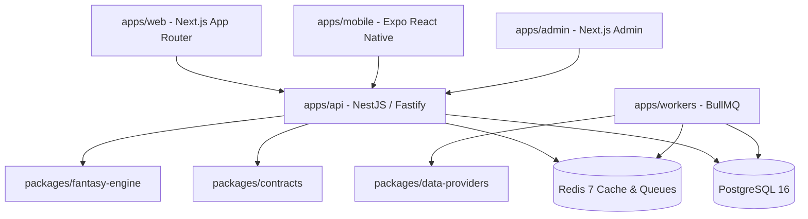

# BotolaHub Architecture Overview

BotolaHub is structured as a **modular monolith** monorepo using pnpm workspaces and Turborepo.

## System Components

## Workspace Layout

### Applications (`apps/`)
- `web`: User-facing web application built with Next.js 14 App Router and Vanilla CSS design tokens.
- `admin`: Operations and system management dashboard built with Next.js 14 App Router.
- `mobile`: Cross-platform mobile app built with Expo React Native and Expo Router.
- `api`: NestJS API application using the Fastify adapter and REST conventions under `/api/v1`.
- `workers`: Background queue processor for match data ingestion and fantasy scoring calculations using BullMQ.

### Shared Packages (`packages/`)
- `contracts`: Shared Zod DTO schemas and type definitions.
- `api-client`: Typed fetch client wrapper for client applications.
- `database`: Prisma ORM schema and client wrapper.
- `fantasy-engine`: Pure, side-effect-free deterministic fantasy scoring & squad validation engine.
- `data-providers`: Provider abstraction interface (`FootballDataProvider`) and mock implementation.
- `localization`: i18n dictionaries for Arabic, French, and English, plus RTL utilities.
- `design-tokens`: Shared brand color palette (Atlas emerald, Moroccan red, gold, deep navy), typography, and spacing tokens.
- `config`: Shared TypeScript, ESLint, and Prettier configurations.
- `test-utils`: Shared unit testing helpers.
